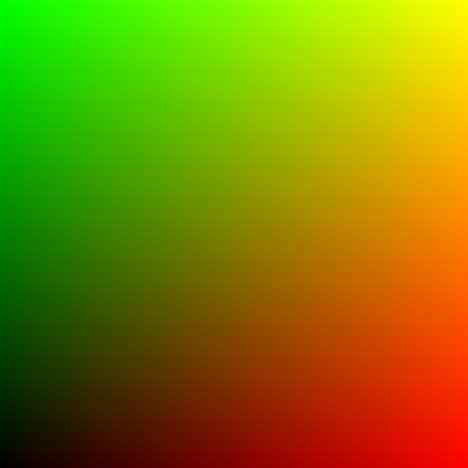
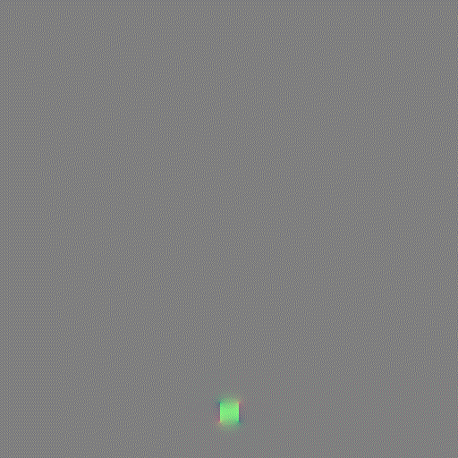
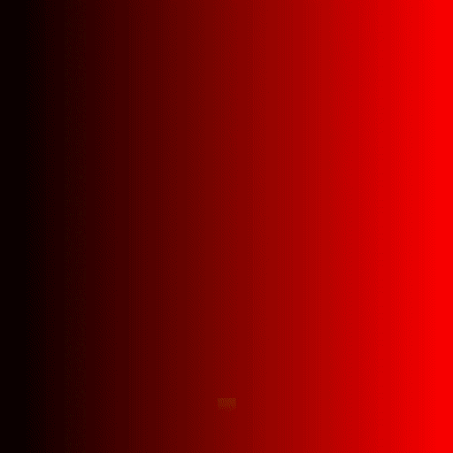
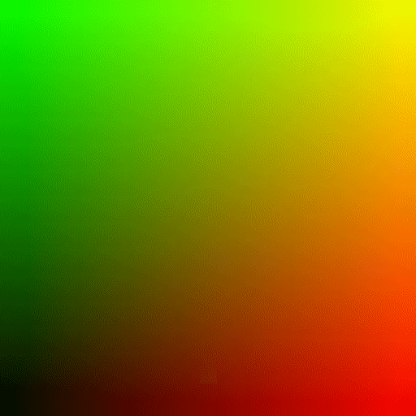

Here we showed detailed comparisons between different Euler methods.

- Euler-based Scheme
  - Advection-Projection(Stable fluid)
  - Advection-Reflection(MC + R)
  - BiMocq2
- Grid
  - Uniform
  - Mac( staggered )
- Advection
  - Semi-Lagrangian
  - MacCormack / BFECC
  - BiMocq2
- Projection
  - Jacobian
  - Gauss-Seidel 
  - Multi-Grid Preconditioned Conjugate Gradient ( copied from [official](https://github.com/taichi-dev/taichi/blob/master/examples/mgpcg_advanced.py)...)

#### Simple Show Case

- AP = advection-projection

- AR = advection-reflection

- SL == Semi-Lagrangian

- MC == MacCormack

- JC == Jacobi Iteration

- GS == Gauss Sedial

- MGPCG == Multi-Grid Preconditioned Conjugate Gradient( copied from [official](https://github.com/taichi-dev/taichi/blob/master/examples/mgpcg_advanced.py)..)

- it == iteration

The following results shows the density.

| AP + SL(RK2) + JC(30 it)                 | AP + SL(RK3) + JC(30 it)                 | **AP + MC(RK3) + SD(30 it)**                |
| ---------------------------------------- | ---------------------------------------- | ------------------------------------------- |
|     |     |        |
| **AR + MC(RK3) + SD(30 it)**             | **AR + MC(RK3) + SD(30 it)**             | **AR + MC(RK3) + MGPCG**                    |
|  |  |  |

##### 2D views

Here we simulate a 2D jet by adding **force** from bottom.

| Density                                                      | Divergence ( 0.03 * div + vec3(0.5) )                      | Curl( 0.03 * curl + vec3(0.5))                              | Velocity ( 0.01 * v + vec3(0.5))                         | Velocity-Norm( v.norm * 0.004) (Magma colormap)              |
| ------------------------------------------------------------ | ---------------------------------------------------------- | ----------------------------------------------------------- | -------------------------------------------------------- | ------------------------------------------------------------ |
|  |  |  |  |  |

##### 3D views

Here we simulate a 3D jet by harding coding **velocity** and **density** within the bottom area. We visualize this under one slice along one dimension(here **Z**).

- resolution = [512, 512, 32]

- dt = 0.03
- No vorticity enhancement

| Configure              | Density                                                      | Divergence(0.3 * div + ve3(0.5))                             | Curl(0.03 * curl + vec3(0.5))                                | Velocity(0.04 * abs(v))                                      | Velocity-Norm( v.norm *0.02) (Magma colormap)                |
| ---------------------- | ------------------------------------------------------------ | ------------------------------------------------------------ | ------------------------------------------------------------ | ------------------------------------------------------------ | ------------------------------------------------------------ |
| AP-SLS-JPS-64it-RK3    |  |  |  |  |  |
| AR-MCS-RBGSPS-64it-RK3 |  |  |  |  |  |

##### IVOCK (2014)

Pause the implementation. Find the stream function way too difficult.

##### BiMocq (2019)

Here I adopt

- CFL = 0.5, 
- dt = 0.03, 
- jet_velocity = 0.5

| Density                             | Divergence                         | Velocity                           |
| ----------------------------------- | ---------------------------------- | ---------------------------------- |
|   |  |  |
| **Vorticity**                       | **Backard Map**                    | **Forward** **Map**                |
|  |   |   |

In the map case, we are showing the first map. Each pixel value(R, G, B) represents mapping to (R, G)  in **UV** space.

Why the backmap and forward map stay the same and always map to itself?

**A Failed case**(due to CFL too large...): 

| Density                                          | Velocity field                                           | backward map                                | Forward Map                                 | Distortion                                     |
| ------------------------------------------------ | -------------------------------------------------------- | ------------------------------------------- | ------------------------------------------- | ---------------------------------------------- |
|  |  |  |  |  |

