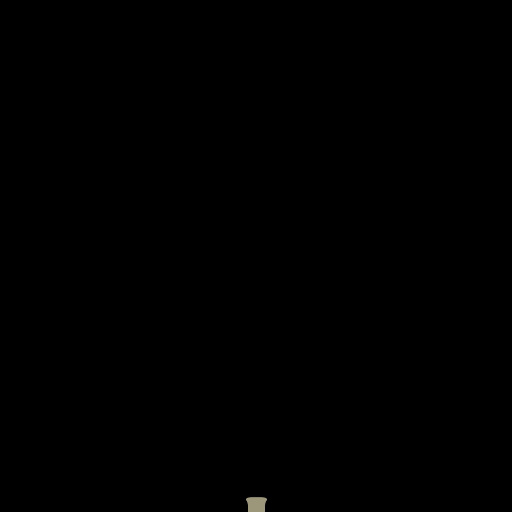

# A toy fluid engine
A repo that tries to reimplement Euler based fluid simulation, currently target on smoke simulation.

The project is based on [Taichi](https://github.com/taichi-dev/taichi), a programming language that embeds both GPU and CPU  parralleled computing.

### Dependency Installation 

```bash
pip install taichi taichi_glsl
```

##### Fast Run

```bash
python exp_play.py --cfg mouse2d # use mouse to drag the fluid
python exp_play.py --cfg jet2d   # shot the jet from below
python exp_play.py --cfg jet3d   # 3D jet
```

#### Feature:

Recently, we support both 2D/3D simulation. The 3D is temporarily visualized by slice.

- Euler-based Scheme
  - Advection-Projection
  - Advection-Reflection
- Advection
  - Semi-Lagrangian
  - MacCormack / BFECC
- Projection
  - Jacobian
  - Gauss-Seidel 
  - Multi-Grid Preconditioned Conjugate Gradient ( copied from [official](https://github.com/taichi-dev/taichi/blob/master/examples/mgpcg_advanced.py)...)


#### [Stable fluid (Siggraph 1999) ](https://dl.acm.org/doi/pdf/10.1145/311535.311548)

| Density                                                      | Velocity                                                     |
| ------------------------------------------------------------ | ------------------------------------------------------------ |
| <a href="./exp_my_fluid.py"> | <a href=",/exp_my_fluid.py">  |


#### Coupling with moving solids(Incomplete)

<a href="https://github.com/Jack12xl/myFluid/blob/master/exp_my_fluid.py"> </a>

I haven't consider the boundary velocity and pressure change caused by moving objects yet. The coupling feature implementation pauses for now. 

#### Simple Show Case

- AP = advection-projection

- AR = advection-reflection

- SL == Semi-Lagrangian

- MC == MacCormack

- JC == Jacobi Iteration

- GS == Gauss Sedial

- MGPCG == Multi-Grid Preconditioned Conjugate Gradient( copied from [official](https://github.com/taichi-dev/taichi/blob/master/examples/mgpcg_advanced.py)..)

- it == iteration


The following results shows the density.

| AP + SL(RK2) + JC(30 it)           | AP + SL(RK3) + JC(30 it)           | **AP + MC(RK3) + SD(30 it)**            |
| ---------------------------------- | ---------------------------------- | --------------------------------------- |
|     |   |        |
| **AR + MC(RK3) + SD(30 it)**       | **AR + MC(RK3) + SD(30 it)**       | **AR + MC(RK3) + MGPCG**                |
|  |  |  |

##### 2D views

Here we simulate a 2D jet by adding **force** from bottom.

| Density                                                  | Divergence ( 0.03 * div + vec3(0.5) )                | Curl( 0.03 * curl + vec3(0.5))                        | Velocity ( 0.01 * v + vec3(0.5))                   | Velocity-Norm( v.norm * 0.004) (Magma colormap)         |
| -------------------------------------------------------- | ---------------------------------------------------- | ----------------------------------------------------- | -------------------------------------------------- | ------------------------------------------------------- |
|  |  |  |  |  |

##### 3D views

Here we simulate a 3D jet by harding coding **velocity** and **density** within the bottom area. We visualize this under one slice along one dimension(here **Z**).

- resolution = [512, 512, 32]

- dt = 0.03
- No vorticity enhancement

| Configure              | Density                                                      | Divergence(0.3 * div + ve3(0.5))                             | Curl(0.03 * curl + vec3(0.5))                                | Velocity(0.04 * abs(v))                                      | Velocity-Norm( v.norm *0.02) (Magma colormap)                |
| ---------------------- | ------------------------------------------------------------ | ------------------------------------------------------------ | ------------------------------------------------------------ | ------------------------------------------------------------ | ------------------------------------------------------------ |
| AP-SLS-JPS-64it-RK3    |  |  |  |  |  |
| AR-MCS-RBGSPS-64it-RK3 |  |  |  |  |  |

From the results, the 3D perspective does have more details than 2D.

#### Mumbled Comparison

- [Advection](./advection/)
- [Projection](./projection/)

- [Euler Solver Scheme](./Scheme)

#### Reference

##### For implementation

- [NVIDIA GPU GEMs](https://developer.download.nvidia.cn/books/HTML/gpugems/gpugems_ch38.html),
- [taichi official example](https://github.com/taichi-dev/taichi/blob/master/examples/stable_fluid.py)
- [Cornell_class_slides](https://www.cs.cornell.edu/~bindel/class/cs5220-s10/slides/lec14.pdf)
-  [offcial tutorial](https://www.bilibili.com/video/BV1ZK411H7Hc?p=4)
-  [Previous Eulerian Fluid Engine With taichi](https://github.com/JYLeeLYJ/Fluid-Engine-Dev-on-Taichi)
-  

##### Paper

- [Efficient and Conservative Fluids with Bidirectional Mapping](https://github.com/ziyinq/Bimocq#efficient-and-conservative-fluids-with-bidirectional-mapping)
- A parallel multigrid poisson solver for fluids simulation on large grids
- Visual simulation of Smoke


