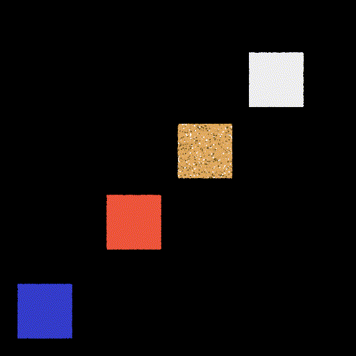

# A toy fluid engine


|                              |                              |                                  |                                  |
| ---------------------------- | ---------------------------- | -------------------------------- | -------------------------------- |
|  |  |  |  |


A repo that tries to reimplement some fluid-related algorithm, 

The project is based on [Taichi](https://github.com/taichi-dev/taichi), a programming language that embeds both GPU and CPU parralleled computing.

### Dependency Installation 

```bash
pip install taichi taichi_glsl
```

##### Fast Run

```bash
python exp_play_Euler.py --cfg mouse2d # use mouse to drag the fluid
python exp_play_Euler.py --cfg jet2d   # shot the jet from below
python exp_play_Euler.py --cfg jet3d   # 3D jet
python exp_play_Euler.py --cfg BMcq_jet2d # takes time
```

#### Feature:

Currently, we support 

- [Euler](./Engine)
- [Material Point Method](./Engine)

In both 2D/3D. The 3D version is rendered with [Taichi Three(Tina)](https://github.com/taichi-dev/taichi_three/tree/master)


#### Reference

##### For implementation

- [NVIDIA GPU GEMs](https://developer.download.nvidia.cn/books/HTML/gpugems/gpugems_ch38.html),
- [taichi official example](https://github.com/taichi-dev/taichi/blob/master/examples/stable_fluid.py)
- [Cornell_class_slides](https://www.cs.cornell.edu/~bindel/class/cs5220-s10/slides/lec14.pdf)
-  [offcial tutorial](https://www.bilibili.com/video/BV1ZK411H7Hc?p=4)
-  [Previous Eulerian Fluid Engine With taichi](https://github.com/JYLeeLYJ/Fluid-Engine-Dev-on-Taichi)
-  

##### Paper

- [Efficient and Conservative Fluids with Bidirectional Mapping](https://github.com/ziyinq/Bimocq#efficient-and-conservative-fluids-with-bidirectional-mapping)
- A parallel multigrid poisson solver for fluids simulation on large grids
- Visual simulation of Smoke
- IVOCK
- MacCormack
- Stable fluid
- Advection-reflection


##### CIS 565 submission

This project is presented in UPenn [CIS 565](https://cis565-fall-2020.github.io/) GPU programming course as a final project.

You can also view other **cool** final project by other students at [here](https://cis565-fall-2020.github.io/projects/)!


