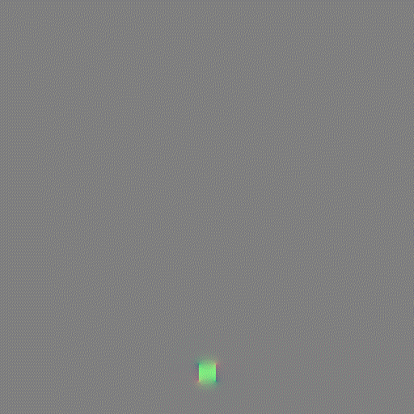

#### Euler Solver Scheme

##### [Advection-Reflection](https://www.google.com/url?sa=t&rct=j&q=&esrc=s&source=web&cd=&cad=rja&uact=8&ved=2ahUKEwiAtZeogrfrAhWIvpQKHRdjAuEQtwIwAXoECAkQAQ&url=https%3A%2F%2Fjzehnder.me%2Fpublications%2FadvectionReflection%2F&usg=AOvVaw12RvEOOxqcZ0C7h5urs7f1)

Both running in RK=3, MacCormack + Gauss-Sedial.

| Advection-Projection               | Advection-Reflection                  |
| ---------------------------------- | ------------------------------------- |
|  |  |

  

#### Performance Comparison

Todo..

##### IVOCK (2014)

Pause the implementation. Find the stream function way too difficult.

##### BiMocq (2019)

Here I adopt

- CFL = 0.5, 
- dt = 0.03, 
- jet_velocity = 0.5

| Density                             | Divergence                         | Velocity                           |
| ----------------------------------- | ---------------------------------- | ---------------------------------- |
|   |  |  |
| **Vorticity**                       | **Backard Map**                    | **Forward** **Map**                |
|  |   |   |

In the map case, we are showing the first map. Each pixel value(R, G, B) represents mapping to (R, G)  in **UV** space.

Why the backmap and forward map stay the same and always map to itself?

Failing case: Velocity field would explooooode.  ..

| Velocity field                                           | backward map                                | Forward Map                                 | Distortion                                     |
| -------------------------------------------------------- | ------------------------------------------- | ------------------------------------------- | ---------------------------------------------- |
|  |  |  |  |

Still In progress.

